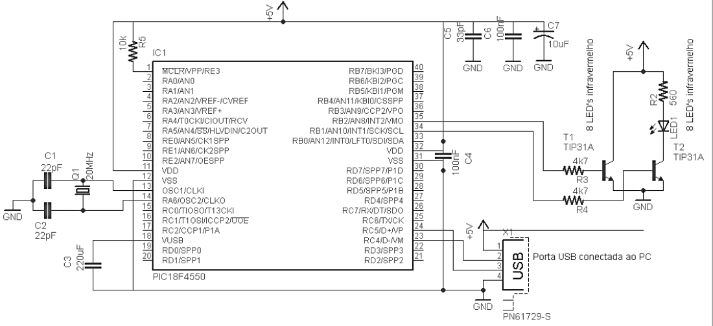
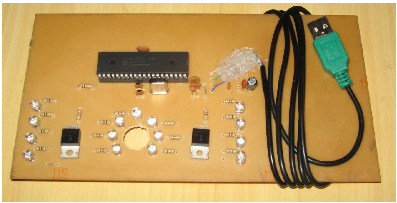
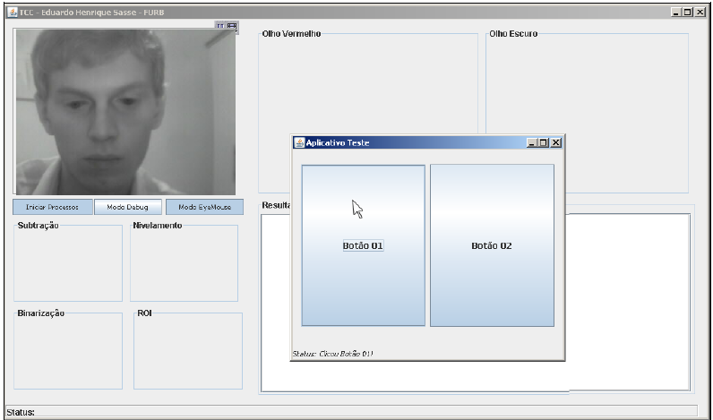

# TCC

This work presents a way that allows an human-computer interaction through eye movements. Using a infrared flash device and a webcam, sensitive to infrared radiation, to monitor the eyes, turns possible in real time the transfer of the movement of an eye to the mouse pointer. 
The flash device was build using the microcontroller PIC18F4550 and infrared LEDs of 850nm. To recognize the eyes region was used the learn machine technique named SVM. Techniques of image processing histogram image analyses, digital image binarization, connected components analysis and others.
   
##Some images

## Stack:
* Java
* LibSVM
* JMF
* RXTX
* ImageJ

